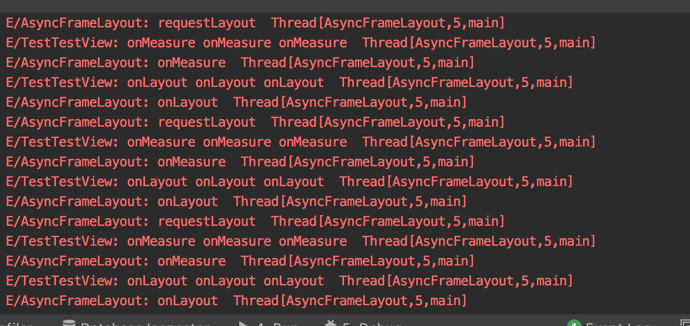

# 异步UI测量逻辑
意在把measure、layout放到子线程，释放主线程渲染压力

### 效果
 

### 核心逻辑
```
    /**
     * 为什么可以覆写这个方法，不继续调用 super.requestLayout()
     * 一方面，明确当前这个view 不会因为我们自己的调度而改变宽高的情况，我们可以这么做
     * 另一方面，如果横竖屏切换，等由系统（其实也就是由父View分发的测量事件）调度，执行measure时
     * 当前view的MeasureSpec 缓存匹配不上，会正常执行测量过程
     */
    override fun requestLayout() {
        //父类构造方法内部会调用这个方法，所以measureHandler 需要判空
        measureHandler?.removeCallbacksAndMessages(null)
        AsyncRenderTask.clearTask()

        measureHandler?.post(AsyncRenderTask.provide(Runnable {
            Log.e("AsyncFrameLayout", "requestLayout  " + Thread.currentThread())

            val widthMeasureSpec = widthMeasureSpecCache ?: MeasureSpec.makeMeasureSpec(
                measuredWidth,
                MeasureSpec.EXACTLY
            )
            val heightMeasureSpec = heightMeasureSpecCache ?: MeasureSpec.makeMeasureSpec(
                measuredHeight,
                MeasureSpec.EXACTLY
            )

            try {
                // 使当前view的测量缓存无效化
                // 保证measure的正常执行
                forceLayout()
                measure(widthMeasureSpec, heightMeasureSpec)
                layout(left, top, right, bottom)

                invalidate()
            } catch (e: IllegalStateException) {
                e.printStackTrace()
            }

        }))
    }

```